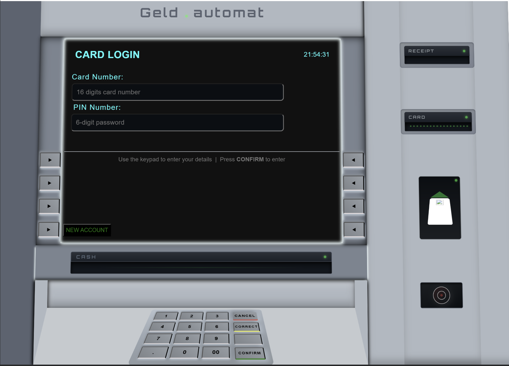

# ATM

ATM is a PHP/MySQL ATM simulation web application with an ATM-style interface and keypad-driven interactions.

## Final Result

   

## Features

- Card number and PIN login
- New account registration
- Balance display on dashboard
- Cash withdrawal and deposit
- Transaction statement filtering by date
- PIN change
- User activity logs
- Account deletion flow with balance checks
- Session timeout and CSRF protection

## Tech Stack

- PHP (procedural + MySQLi)
- MySQL
- HTML/CSS/JavaScript
- XAMPP (Apache + MySQL)

## Project Structure

- `config/` database, session, and security helpers
- `includes/` shared ATM layout shell
- `assets/` styling and UI assets
- `login.php`, `registration.php`, `dashboard.php`, and operation pages

## Setup

1. Place the project in your XAMPP web root (for example `htdocs/ATM`).
2. Create a MySQL database named `bankautomat`.
3. Import your SQL schema/tables for users, accounts, transactions, and user logs.
4. Confirm database settings in `config/db.php`.
5. Start Apache and MySQL from XAMPP.
6. Open the app in your browser:

   `http://localhost/ATM/login.php`

## Main User Flow

1. Register a new account or log in with card + PIN.
2. Use side buttons to navigate between ATM operations.
3. Perform withdraw/deposit actions and confirm via keypad.
4. Review statement/logs as needed.
5. Log out.

## Security Notes

- CSRF token verification is applied to POST forms.
- Session inactivity timeout is enforced.
- Login lockout logic is implemented for repeated failed attempts.
- User actions are recorded in `user_logs`.

## License

This project is for educational/demo purposes.
